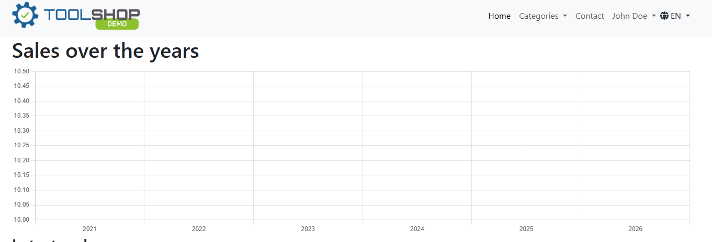
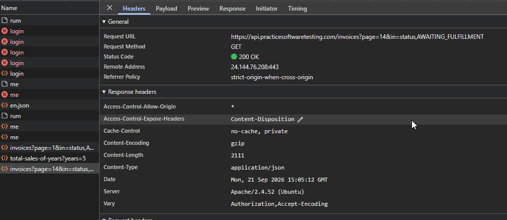

# [BUG-001] Sales Over the Years Graph not Populating

## Environment Details
- **Application:** Tool Shop Demo
- **Environment:** (`https://practicesoftwaretesting.com/admin/dashboard`)
- **Test Account:** admin@practicesoftwaretesting.com
- **Browser:** Chrome
- **Date/Time:** September 21

## Severity & Priority
- **Severity:** Medium
* *Reason:* The system fails to display the average sales in graph form over the years using invoice data. While the system is functional, no business utility is being provided.
- **Priority:** Medium

## Prerequisites / Pre-conditions
1. Tool Shop Demo is running
2. User is logged in using the admin test account.
3. User is on the admin dashboard screen

## Steps to Reproduce
1. Navigate to (`https://practicesoftwaretesting.com`).
2. Enter (admin@practicesoftwaretesting.com) as the username.
3. Enter (welcome01) as the password and press sign in.
4. The page should redirect to the admin dashboard

## Expected Result
The graph should be populated with historic sales data for easy viewing.

## Actual Result
The UI generates a graph with a line generated across the 0 axis (no visible line drawn) due to the back-end service returning `total: 0` for all requested years

## Test Data / Edge Case Notes
This issue was discovered by logging into the system and seeing 200 API status codes with failed JSON data warnings. The issue only appears to happen on initial login of the account.

## Technical Diagnosis

### 1. Network Trace
* **Request URL:** `https://api.practicesoftwaretesting.com/reports/total-sales-of-years?years=5` 
* **Status Code:** `200 OK`
* **Response Payload:**
```
[
    {
        "year": 2021,
        "total": 0
    },
    {
        "year": 2022,
        "total": 0
    },
    {
        "year": 2023,
        "total": 0
    },
    {
        "year": 2024,
        "total": 0
    },
    {
        "year": 2025,
        "total": 0
    },
    {
        "year": 2026,
        "total": 0
    }
]
```


## Attachments
- **Screenshots/Video:** 
- **Console Logs:** 