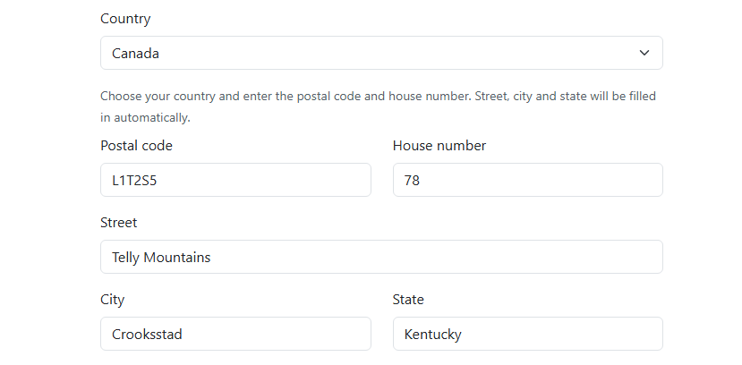
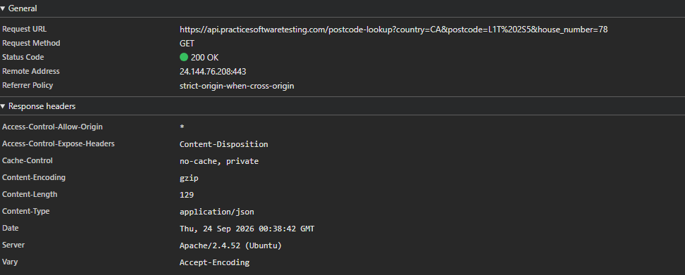

# [BUG-002] Postal Code Lookup Populates US Mock Data for Canadian Addresses

## Environment Details
- **Application:** Tool Shop Demo
- **Environment:** (`https://practicesoftwaretesting.com/auth/register`)
- **Test Account:** Create an account
- **Browser:** Chrome
- **Date/Time:** September 23

## Severity & Priority
- **Severity:** Low
* *Reason:* The system fails to generate the correct street, city, and state when auto-filling address. 
- **Priority:** Low

## Prerequisites / Pre-conditions
1. Tool Shop Demo is running
2. User attempts to create a new account

## Steps to Reproduce
1. Navigate to (`https://practicesoftwaretesting.com`).
2. Press Sign in at the top of the page and click "Register your account"
3. Select your country (Canada used during testing)
4. Enter valid postal code (L1T2S5) and house number (78)
5. The page should autofill the street, city and state

## Expected Result
If postal lookup is only supported for specific regions (e.g., US), non-supported formats should leave fields blank for manual entry without inserting mismatched mock data.

## Actual Result
The application populates mismatched US mock address data (`Telly Mountains`, City: `Crooksstad`, State: `Kentucky`) despite the country explicitly being set to **Canada**.

## Test Data / Edge Case Notes
This issue was discovered while attempting to create a new user with correct data.

## Technical Diagnostics
* **Request URL:** `GET https://api.practicesoftwaretesting.com/postcode-lookup?country=CA&postcode=L1T%202S5&house_number=78`
* **Status Code:** `200 OK`
* **Response Payload**
```json
{
    "street": "Telly Mountains",
    "house_number": "78",
    "city": "Crooksstad",
    "state": "Kentucky",
    "country": "CA",
    "postcode": "L1T2S5"
}
```

## Attachments
- **Screenshots/Video:** 
- **Console Logs:** 