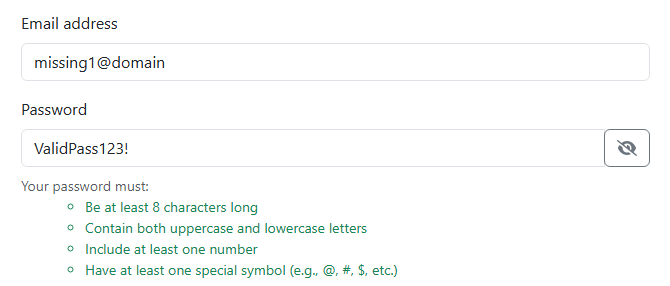
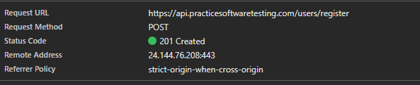
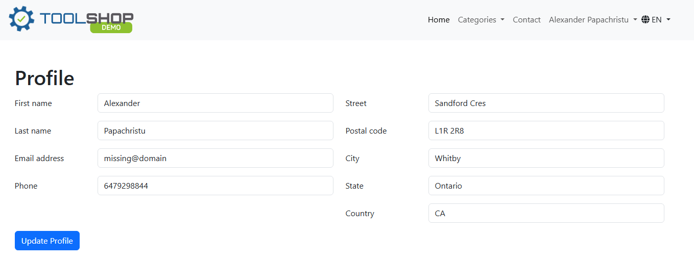

# [BUG-003] Registering a new account with an improperly formatted email  

## Environment Details
- **Application:** Tool Shop Demo
- **Environment:** (`https://practicesoftwaretesting.com/auth/register`)
- **Test Account:** Create an account
- **Browser:** Chrome
- **Date/Time:** September 24

## Severity & Priority
- **Severity:** High
* *Reason:* The system allows new user accounts to be created with an invalid email address.
- **Priority:** High

## Prerequisites / Pre-conditions
1. Tool Shop Demo is running
2. User attempts to create a new account

## Steps to Reproduce
1. Navigate to (`https://practicesoftwaretesting.com`).
2. Press Sign in at the top of the page and click "Register your account".
3. Input all properly formatted information except for the email.
4. Add an email into the account using the @ symbol without the domain (`missing@domain`).
5. Press "Register".

## Expected Result
The system should find there is no domain present in the email and disallow the user from making an account.

## Actual Result
The application creates an account with an improper email.

## Test Data / Edge Case Notes
This issue was discovered while attempting to create a new user with an improperly formatted email.

## Technical Diagnostics
* **Request URL:** `POST https://api.practicesoftwaretesting.com/users/register`
* **Status Code:** `201 Created`
* **Response Payload**
```json
{
    "first_name": "Alexander",
    "last_name": "Papachristu",
    "dob": "2000-01-24",
    "phone": "6479298844",
    "email": "missing@domain",
    "id": "01m3ata252d5v646j2vv0ab6zm",
    "created_at": "2026-09-24 22:59:17",
    "address": {
        "street": "Sandford Cres",
        "house_number": 25,
        "city": "Whitby",
        "state": "Ontario",
        "country": "CA",
        "postal_code": "L1R 2R8"
    }
}
```

## Attachments
- **Screenshots/Video:** 


- **Console Logs:** 


- **Profile Page:** 
