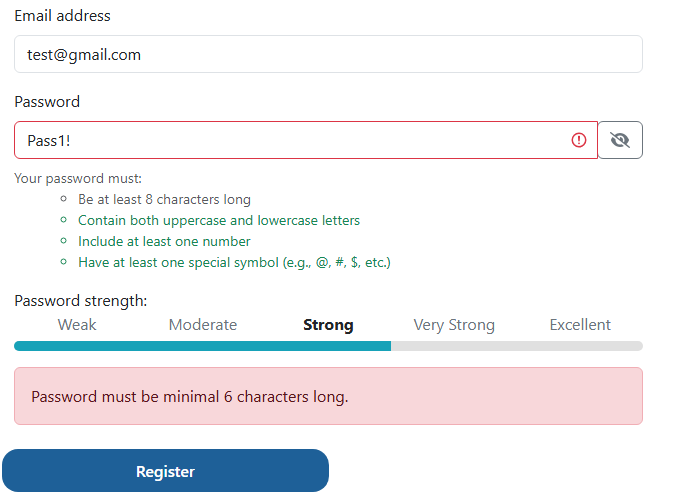

# [BUG-005] Inconsistent Password Requirements

## Environment Details
- **Application:** Tool Shop Demo
- **Environment:** (`https://practicesoftwaretesting.com/auth/register`)
- **Test Account:** Create an account
- **Browser:** Chrome
- **Date/Time:** September 24

## Severity & Priority
- **Severity:** Medium
* *Reason:* The system shows different requirements for password length.
- **Priority:** Medium

## Prerequisites / Pre-conditions
1. Tool Shop Demo is running
2. User attempts to create a new account

## Steps to Reproduce
1. Navigate to (`https://practicesoftwaretesting.com`).
2. Press Sign in at the top of the page and click "Register your account".
3. Input all properly formatted information except for the password.
4. Add a password with less than 9 characters (`Pass1!`)

## Expected Result
The system should find there is an invalid password and display a message telling the user the password is required to be at least 8 characters long.

## Actual Result
The application displays a message saying the "Password must be minimal 6 characters long".

## Test Data / Edge Case Notes
This issue was discovered while attempting to create a new user with a password less than 8 characters.

## Attachments
- **Screenshots/Video:** 

