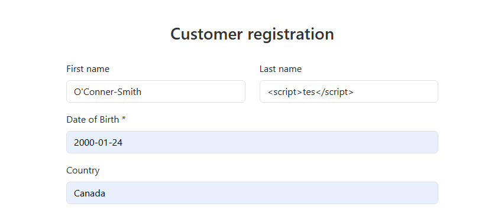
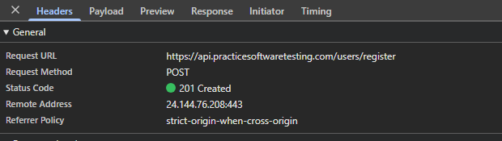

# [BUG-006] Registering a New Account With Invalid Characters 

## Environment Details
- **Application:** Tool Shop Demo
- **Environment:** (`https://practicesoftwaretesting.com/auth/register`)
- **Test Account:** Create an account
- **Browser:** Chrome
- **Date/Time:** September 24

## Severity & Priority
- **Severity:** High
* *Reason:* The system allows new user accounts to be created with script tags in the last name allowing for SQL injection attacks in a live system.
- **Priority:** High

## Prerequisites / Pre-conditions
1. Tool Shop Demo is running
2. User attempts to create a new account

## Steps to Reproduce
1. Navigate to (`https://practicesoftwaretesting.com`).
2. Press Sign in at the top of the page and click "Register your account".
3. Input all properly formatted information except for the last name.
4. Enter a last name into the box with script tags (`<script>tes</script>`) ensuring it is less than 20 characters.
5. Press "Register".

## Expected Result
The system should determine there are invalid characters in the last name and show an error on screen

## Actual Result
The application successfully creates an account with script tags in the last name.

## Test Data / Edge Case Notes
This issue was discovered while attempting to create a new user with script tags in the last name field.

## Technical Diagnostics
* **Request URL:** `POST https://api.practicesoftwaretesting.com/users/register`
* **Status Code:** `201 Created`
* **Response Payload**
```json
{
    "first_name": "O'Conner-Smith",
    "last_name": "<script>tes<\/script>",
    "dob": "2000-01-24",
    "phone": "6479298844",
    "email": "randomEmail@gmail.com",
    "id": "01m3b2v8p4j1m0c6zrx2fh5as0",
    "created_at": "2026-09-25 01:28:30",
    "address": {
        "street": "Elmira Burgs",
        "house_number": null,
        "city": "East Rylee",
        "state": "New Hampshire",
        "country": "CA",
        "postal_code": "L1R 2R8"
    }
}
```

## Attachments
- **Screenshots/Video:** 


- **Console Logs:** 

