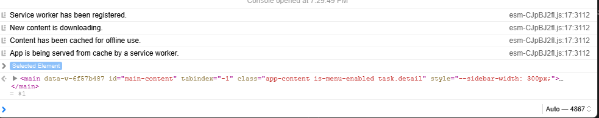
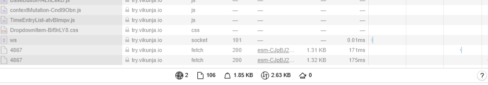
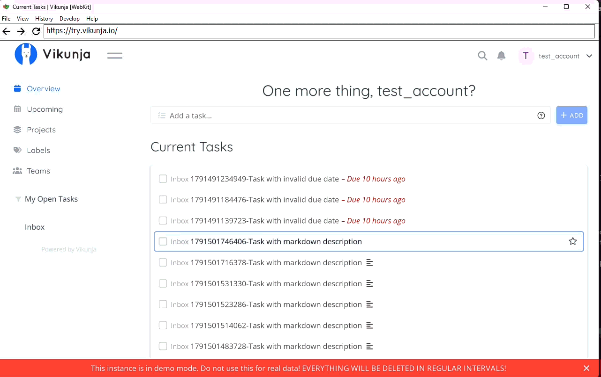

# [BUG-001] Selected text is deleted when pressing Enter to confirm a link URL in the task description (WebKit)

## Environment Details
- **Application:** Vikunja.io Version v2.7.0-6-ge7d7f173
- **Environment:** (`https://try.vikunja.io`)
- **Test Account:** test_account
- **Browser:** WebKit (Playwright build)
- **Playwright Version:** Version 1.63.0
- **OS Version:** Windows 11 25H2
- **Date/Time:** 2026-10-08

## Severity & Priority
- **Severity:** Major
- **Reason:** When turning a word into a link in the task description, pressing enter to save the link deletes the word entirely.
- **Priority:** High

## Prerequisites / Pre-conditions
1. Log into any account on try.vikunja.io 

## Steps to Reproduce
1. Create a new task by clicking the `Add a task...` textbox and entering a title.
2. Press the `Add` button.
3. Select the task from the current tasks area.
4. Type "Link" into the description area and highlight it.
5. Press the link button from the toolbar and enter https://example.com into the URL area.
6. Press the enter key to confirm the link.

## Expected Result
The description should have a link to the provided URL attached to the highlighted word.

## Actual Result
The selected word is replaced by an empty new line and no link is created.

## Reproducibility 
5/5 Attempts

## Test Data / Edge Case Notes
This issue was discovered while testing markdown text functionality in the description across different browsers. The functionality worked on Chromium, and Firefox browsers but failed when running the test on WebKit. Not yet confirmed on Safari.  

## Technical Diagnostics

The console throws no errors while the link is being removed from the description.

Checking the network tab, no errors are detected. No failed requests (4xx/5xx). 

## Attachments
- **Screenshots/Video:** 

